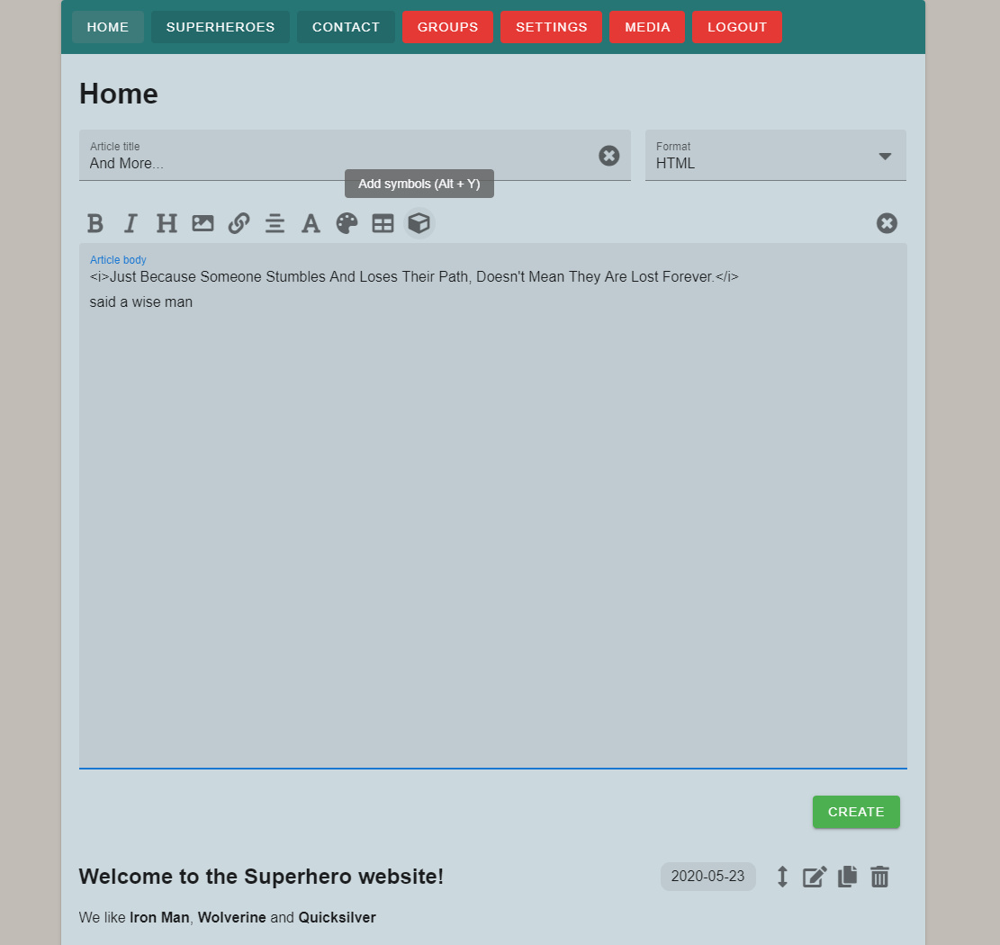

# TightCMS
## Content Management System - fast and easy to deploy

- License: MIT License
- Author: Matteljay
- Language: Vue.JS
- IDE: Visual Studio Code
- Homepage: https://libersystems.com

## Table of contents

- [About](#about)
- [Screenshots](#screenshots)
- [Installation](#installation)
  - [Docker microservices](#docker-microservices)
  - [Manual installation](#manual-installation)
  - [Important tweaks and security notes](#important-tweaks-and-security-notes)
- [Documentation](#documentation)
  - [Adding pages and sub-pages to your website](#adding-pages-and-sub-pages-to-your-website)
  - [Adding different article types to your pages](#adding-different-article-types-to-your-pages)
  - [Article text editor HTML tricks](#article-text-editor-html-tricks)
  - [Using the Settings menu](#using-the-settings-menu)
  - [Using the Media menu](#using-the-media-menu)
- [Technical details](#technical-details)
- [Contact info & donations](#contact-info--donations)

## About

TightCMS is a full Content Management System written in [VueJS](https://vuejs.org/). It is light weight and easy to set up on any [VPS](https://en.wikipedia.org/wiki/Virtual_private_server). With this application, your bloggers or HTML/CSS savvy friends or customers can quickly get started creating a website. They will retain complete control of their own data and can easily upload files to integrate into their website. Or use it as an online file sharing repository. It was loosely inspired by [Joomla](https://www.joomla.org/) and [WordPress](https://wordpress.org/). However they are a lot more feature-rich. If you want a fast, light, secure and easy-to-set-up solution, TightCMS is for you.

Introduction video: [bitchute.com](https://www.bitchute.com/video/oX3AgHj0jlUX/) [youtube.com](https://youtu.be/uv1ny-NJT_k)

## Screenshots





## Installation

This section is meant for the system administrator controlling the VPS, not the site administrator. If you want to know in detail how TightCMS works with all the special tricks, skip to the [documentation section](#documentation).

Two types of installation will be discussed, one with Docker and one without. The first option is the fastest and easiest. Using the docker-compose command, the database and `uploads/` mount point will be automatically created for you.

The second option is useful if your server doesn't have an AMD64 architecture. On a Raspberry Pi for example (ARM architecture), go with the manual installation.

There is also a third section with important production environment tweaks.

### Docker microservices

A modern VPS should already have [Docker](https://docs.docker.com/engine/install/) and [Docker Compose](https://docs.docker.com/compose/install/) installed. These 3 commands offer the fastest startup & working demonstration based on the example [docker-compose.yml](docker-compose.yml)
```
mkdir -p tightcms/uploads/
cd tightcms/
chown 1000:1000 uploads/
wget https://github.com/Matteljay/tightcms/raw/master/docker-compose.yml
docker-compose up -d
```
TightCMS should now be available from the internet at http://your-server-ip
For a production environment, you definitely should personalize some security settings inside of `docker-compose.yml`. The content of variables `USER_PW_SALT` and `JWT_SECRET` should both be replaced by passwords of your choosing.

### Manual installation

First, you will need to install MongoDB manually. You could use the [community installation guide](https://docs.mongodb.com/manual/administration/install-on-linux/). But it may be easier to use your OS' package manager, for example: `apt install mongodb`

Next, you may want to use `screen` (or [systemd](https://www.shellhacks.com/systemd-service-file-example/)) so that you can log out of your VPS and keep TightCMS running as a service: `apt install screen`

Then these few commands will get you started the quickest:
```
git clone https://github.com/matteljay/tightcms
cd tightcms/server/
sudo screen -d -m ./start-nodocker.sh
```
And there you go, TightCMS running on your machine and available from the internet at http://your-server-ip
For a production environment, you definitely should personalize some security settings inside of `start-nodocker.sh`. The content of variables `USER_PW_SALT` and `JWT_SECRET` should both be replaced by passwords of your choosing.

### Important tweaks and security notes

It is highly recommended to use a web server and set it up as a reverse proxy. I prefer [Nginx](https://en.wikipedia.org/wiki/Nginx) but others (Apache, Lighttpd,...) should work as well. By doing this you get several advantages:
- The ability to use TLS/SSL secure web traffic so your website can be configured to use `https://`. You will need to generate or buy certificates for your domain name.
- Gzip compression giving you more efficient client-server communication. Meaning faster page load times.
- Traffic throttling, it may be needed to reduce the available bandwidth used to keep your site running smoothly.
- Connection metrics logging to see how many people visit your site.
- More [security features](https://www.acunetix.com/blog/articles/nginx-server-security-hardening-configuration-1/).

Setting up a web server is beyond the scope of this documentation so start with the [Nginx guide](https://docs.nginx.com/nginx/admin-guide/web-server/). Then you'll want to change TightCMS' `EXPRESS_PORT` server setting to 5000 and configure Nginx to be set up as a [reverse proxy](https://docs.nginx.com/nginx/admin-guide/web-server/reverse-proxy/).

Care was taken to make TightCMS as secure as reasonably possible. However there has been no independent security audit and no warranty is given. With a bit of extra effort however, it is possible to run TightCMS as user **node** (GID:UID = 1000:1000). That should make it harder for hackers to do [bad things](https://stackoverflow.com/questions/19054029/security-of-docker-as-it-runs-as-root-user) on your VPS if a security vulnerability exists. These are the steps to run TightCMS as a user in your Docker container:
- Make sure you set the `EXPRESS_PORT` setting higher than 1023, non-root users cannot use low port numbers like 80.
- Then add the line `user: node` to the service of your docker-compose.yml
- Update permissions for uploaded files with `chown -R 1000:1000 uploads/`
- Do a full container removal & restart with `docker-compose down && docker-compose up -d`

## Documentation

There are several features demonstrated in the introduction video. Here listed again with some details and tricks. To access the site-admin login screen, you can browse to http://your-server-ip/login, typing this yourself or bookmarking that page. On a PC however a trick is to hold the `Alt` key while mouse-clicking on an **empty** part of the menu bar. After logging in, there is also an ability to change the site-admin's password, for that go to http://your-server-ip/changepass.

### Adding pages and sub-pages to your website

The Groups menu makes it possible to add pages, sub-pages, rename them and move them around. Pretty straight forward. But here is a trick: you can move a group-A with subgroups-A attached, **inside** of group-B. You've nested subgroups-A one level too deep, now no site visitor can access those. Rest assured all the linked articles will still exist and you can undo the operation at any time by moving it out. You have temporarily hidden parts of your website.

### Adding different article types to your pages

After creating a page and visiting it as site-admin, you'll see a nice text area to create new articles in. In the "Article title" area you can now decide if you want to supply a title or not. If you choose to provide one, the creation date will be printed next to the title after hitting the Create button below the big text area. However if you leave the title empty, no date is ever printed which is more suitable for free-style content.

In the "Format" area, you can choose different types for the content you're creating:
- HTML: write in the powerful [HTML](https://www.w3schools.com/html/html_intro.asp) language of the web, extend it with [CSS](https://www.w3schools.com/html/html_css.asp) in `<style>` tags and you get access to the entire page layout.
- Markdown: this is a heavily simplified form of HTML but much more readable. Learn all the tricks [here](https://github.com/adam-p/markdown-here/wiki/Markdown-Cheatsheet).
- Plain Text: the simplest form of writing, very fast and clear but will be less pretty for tables, lists and such.

The format last used will be stored every time you create an article.

Articles and pages are stored in the database so that they are fast & easy to manage. You can perform several operations on articles: move, edit, copy and delete. Moving an article to a different page is easy, click the vertical move arrow and visit whatever page you want to move it to. Once you created an article, clicking on the title will copy the specific local URL to that article on that page (#anchor link) to your clipboard.

### Article text editor HTML tricks

The article editor has several shortcut functions available which are displayed as icons. Hover with your mouse over them to see the associated keyboard shortcuts. The functions are: bold font, italic font, add heading, add image, add link, align text, font size, font color, add table example and add symbol.

Furthermore, two commonly used website design tasks have been automated:
- add an index for all the articles of your page with `id="LiveArticles"`
- add an index for all the sub-pages of your page with `id="LivePages"`
  
Usage, try these examples in an article on one of your pages with a lot of other articles or sub-pages:
```html
<ul>
    <li id="LiveArticles"></li>
</ul>
```
```html
<table class="mytable">
    <tr><td id="LivePages" class="mytd"></td></tr>
</table>
<style>
    .mytable { width: 100%; }
    .mytd { text-align: center; background-color: green; }
    .mytd:nth-child(even) { background-color: red; }
</style>
```

### Using the Settings menu

On the site-admin's Settings page, several changes can be made dynamically to your website. Site title & [favicon](https://en.wikipedia.org/wiki/Favicon), header image, color for the different sections, content wrapper width, global font & font size, date display format, unordered list image and the footer text can all be changed.

Menu color and footer color will show a color picker. Background and foreground settings will offer a more extensive dialog with different fill and image options.

Some fields require a **Path to ...**. Here you could fill out an URL to an external image on the web. But it is much better and faster to use a local link to a file from the Media page. There you can click an image file to copy the link to your clipboard. Then you can paste it in the required field on the Settings page. A local link starts with `/` instead of `http://`.

### Using the Media menu

Here you can upload any file you want from your local device or multiple at once. After the new file's name is displayed, it is immediately available for public use. You will have to share the link of course. Click the file name to copy its local link to your clipboard. Then you can integrate it into any article, for example `<a href="/your-local-link">TEST</a>` or ``. Or paste it on the Settings page where **Path to ...** is required.

On the right of each file you can use file operations: download, rename or delete. The ability to create new folders is available as well, after which you can rename or delete them recursively.

The **DB backup** button allows you to instantly save all of your work. Files ending with the name `MongoDB-TightCMS.json` are treated as special backup files. If you click them, a confirmation dialog will pop up asking you if you want to overwrite the current website with the backup. Also make sure you download those backup files to your own local machine for added peace of mind.

Note that if you're on PC, you can hold the `Alt` key while left-clicking **DB backup**. Then a confirmation dialog will pop up asking you if you want to delete everything in the database and factory reset your website. This is a hidden trick mostly for developers but might be useful if you want to start with a clean slate. No backup or regular files will be deleted but you will need to create a new site-admin password.

## Technical details

The front-end is an [SPA](https://en.wikipedia.org/wiki/Single-page_application) loaded once in its entirety during initial visit or page refresh. A quick connection is made to the Express back-end to fetch the customizations and site content data. The speed and reaction time for browsing on the page are very pleasant as they are determined completely client-side. The back-end is always ready to receive site-admin commands via the online integrated menus after authentication. A high degree of privacy is respected via both client-side and server-side password hashing & salting before storing in MongoDB.

TightCMS has been tested most extensively on the Brave Browser and Mozilla Firefox. Microsoft Edge was given a quick test as were several Android phones and iPhones. Therefore it is assumed that Chromium, Google Chrome and MacOS Safari shouldn't have problems.

It started as a self-study project in order to become fluent in these technologies:
- VueJS modern JavaScript framework
- Vuex memory state management
- Vuetify components (dialogs, buttons, bootstrap-based style,...)
- Express NodeJS server
- MongoDB No-SQL Database
- Docker containerization microservices
- Using and writing JSON Web APIs
- CRUD apps with smartphone-friendly re-ordering capabilities
- Web security and authentication via JWT tokens
- Live file management application

But also to brush up on general HTML, CSS and JavaScript (ECMAScript 6) skills.

The size of the code base is approximately 2500 lines, broken down here:
- 14 views + components: 890 + 730
- 4 vuex store modules: 420
- 1 router module: 110
- Total front-end: 2150
- Total back-end: 400

Check out the [DEV-STRUCTS.md](DEV-STRUCTS.md) to understand how the site-admin's input gets stored into MongoDB.

## Contact info & donations

More info here: [Contact](CONTACT.md), [QR-codes](donate-qr.jpg)
